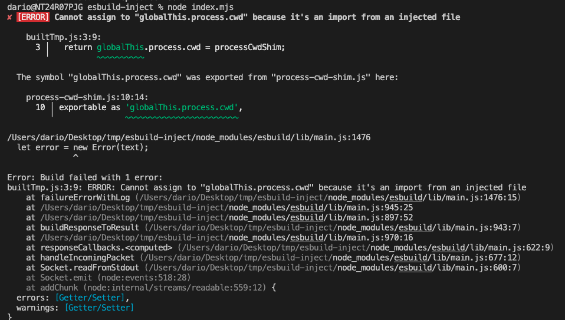

Reproduction steps:

- `npm i`

- `git checkout 9b6f4b4c4b67be7` to get to the commit with the reproduction

- run `node index.mjs`, which will result in:
  

- run `git checkout main`

- now `node index.mjs` should work
